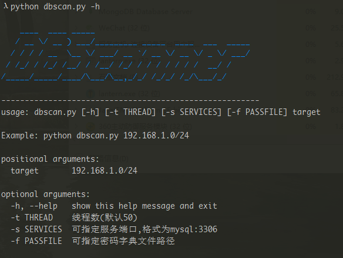

# DBScanner
自动扫描内网常见sql、no-sql数据库脚本(mysql、mssql、oracle、postgresql、redis、mongodb、memcached、elasticsearch)，包含未授权访问及常规弱口令检测




## 2019.9.25修改

1. 添加-f参数，可选择密码字典
2. 添加-s参数，可以设置服务的端口

## todo list

- [x] 添加requirements.txt (2019.10.03)
- [ ] 添加其他未授权访问扫描模块

## attention!
you need install some modules:
```
apt-get install libmysqlclient-dev libpq-dev python-dev
```